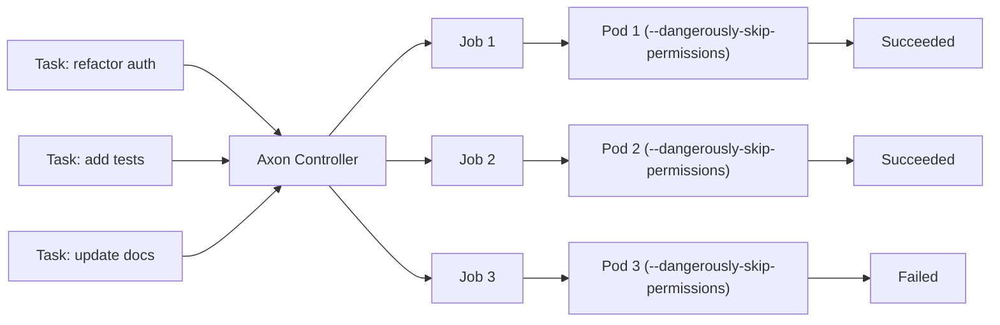
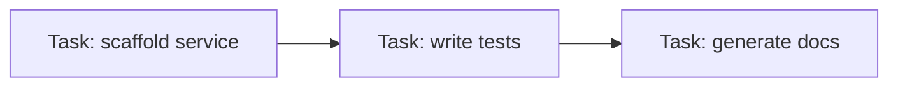

# Axon

**Run autonomous AI agents safely — at scale, in CI, on Kubernetes.**

[](https://github.com/gjkim42/axon/actions/workflows/ci.yaml)
[](https://github.com/gjkim42/axon)
[](https://opensource.org/licenses/Apache-2.0)

## Why Axon?

AI coding agents like Claude Code are most powerful when they run with `--dangerously-skip-permissions` — no human in the loop, fully autonomous. But on your laptop, that flag lives up to its name: the agent can touch your filesystem, network, and everything else on the host. And there's no easy way to fan out dozens of agents across repos, or plug them into a CI pipeline.

**Kubernetes solves both problems at once.** Inside a Pod, "dangerously skip permissions" isn't dangerous anymore — the agent gets full autonomy *within* an isolated, ephemeral container while the blast radius stays at zero for the host. And because it's Kubernetes, you get parallelism, scheduling, and CI integration for free.

Axon is the controller that ties it together. Define what you want the agent to do, and Axon runs it as an isolated Job with `--dangerously-skip-permissions` enabled by default.

- **Safe autonomy** — agents run with `--dangerously-skip-permissions` inside isolated, ephemeral Pods. Full speed, zero risk to the host.
- **Scale out** — launch hundreds of agents in parallel across repositories. Kubernetes handles scheduling and resource management.
- **CI-native** — trigger agents from any pipeline. A Task is just a Kubernetes resource — create it with `kubectl`, Helm, Argo, or your own tooling.
- **Observable** — watch agents move through `Pending → Running → Succeeded/Failed` with kubectl.
- **Simple** — one CRD, one controller, zero dependencies beyond a running cluster.

## How It Works



1. You **apply a Task** manifest with a prompt, agent type, credential reference, and optionally a git repo to clone.
2. The **Axon controller** creates a Kubernetes **Job**.
3. If a workspace is specified, an **init container clones the repo**. Then the agent Pod starts with `--dangerously-skip-permissions`.
4. The agent runs **fully autonomous** inside the container — no permission prompts, no risk to the host.
5. Axon **tracks status** (phase, pod name, timestamps, messages). Delete the Task and the Job + Pod are automatically cleaned up via owner references.

Currently supported agents: **Claude Code** (`claude-code`).

## Quick Start

### Prerequisites

- Kubernetes cluster (1.28+)
- kubectl configured

### Install

```bash
kubectl apply -f https://raw.githubusercontent.com/gjkim42/axon/main/install-crd.yaml
kubectl apply -f https://raw.githubusercontent.com/gjkim42/axon/main/install.yaml
```

### Install the CLI

```bash
go install github.com/gjkim42/axon/cmd/axon@latest
```

### Run Your First Task

1. Initialize a config file:

```bash
axon init
```

Edit `~/.axon/config.yaml` with your token:

```yaml
oauthToken: <your-oauth-token>
```

2. Run a task:

```bash
axon run -p "Create a hello world program in Python" -w
```

Axon auto-creates the Kubernetes secret from your token.

3. Watch it go:

```
NAME              TYPE          PHASE      AGE
task-a1b2c        claude-code   Pending    0s
task-a1b2c        claude-code   Running    3s
task-a1b2c        claude-code   Succeeded  42s
```

Run against a git repo:

```bash
axon run -p "Add unit tests" \
  --workspace-repo https://github.com/your-org/repo.git --workspace-ref main -w
```

<details>
<summary>Using kubectl and YAML instead of the CLI</summary>

```yaml
apiVersion: axon.io/v1alpha1
kind: Task
metadata:
  name: hello-world
spec:
  type: claude-code
  prompt: "Create a hello world program in Python"
  credentials:
    type: oauth
    secretRef:
      name: claude-oauth
```

```bash
kubectl apply -f task.yaml
kubectl get tasks -w
```

Add `spec.workspace` to clone a repo before the agent starts:

```yaml
  workspace:
    repo: https://github.com/your-org/your-repo.git
    ref: main
```

</details>

<details>
<summary>Using an API key instead of OAuth</summary>

Set `apiKey` instead of `oauthToken` in `~/.axon/config.yaml`:

```yaml
apiKey: <your-api-key>
```

Or pass `--secret` to `axon run` with a pre-created secret (api-key is the default credential type), or set `spec.credentials.type: api-key` in YAML.

</details>

## Features

| Feature | Details |
|---------|---------|
| Safe Autonomy | Agents run with `--dangerously-skip-permissions` inside isolated, ephemeral Pods |
| Scale Out | Run hundreds of agents in parallel — Kubernetes handles scheduling |
| CI-Native | Trigger agents from any pipeline via `kubectl`, Helm, Argo, or your own tooling |
| Git Workspace | Clone a repo into the agent's working directory via `spec.workspace` |
| Config File | Set token, model, namespace, and workspace in `~/.axon/config.yaml` — secrets are auto-created |
| CLI | `axon init`, `axon run`, `axon get`, `axon logs`, `axon delete` — manage tasks without writing YAML |
| Full Lifecycle | `Pending` → `Running` → `Succeeded` / `Failed` |
| Owner References | Delete a Task and its Job + Pod are automatically cleaned up |
| Credential Management | API key and OAuth supported via Kubernetes Secrets |
| Model Selection | Override the default model per-task with `spec.model` |
| Status Tracking | Job name, pod name, start/completion times, and messages |
| Leader Election | Safe multi-replica deployment out of the box |
| Minimal Footprint | Distroless container, 10m CPU / 64Mi memory requests |
| Extensible | Pluggable agent type — add new agents via the `switch` in `job_builder.go` |

## Use Cases

- **Hands-free CI** — let an autonomous agent generate, refactor, or fix code as a pipeline step, with no permission prompts blocking the run.
- **Batch refactoring at scale** — spin up dozens of agents in parallel to apply the same prompt across microservices, each safely isolated in its own Pod.
- **Scheduled maintenance** — pair with a CronJob or workflow engine to run recurring code-health agents on a schedule.
- **Developer self-service** — expose agent execution through an internal portal so any developer can run a fully autonomous AI agent without local setup.
- **AI in your internal platform** — embed Axon as the execution layer for AI-powered features in your developer platform.

## Reference

### Task Spec

| Field | Description | Required |
|-------|-------------|----------|
| `spec.type` | Agent type (`claude-code`) | Yes |
| `spec.prompt` | Task prompt for the agent | Yes |
| `spec.credentials.type` | `api-key` or `oauth` | Yes |
| `spec.credentials.secretRef.name` | Secret name with credentials | Yes |
| `spec.model` | Model override (e.g., `claude-sonnet-4-20250514`) | No |
| `spec.workspace.repo` | Git repository URL to clone (HTTPS, git://, or SSH) | No |
| `spec.workspace.ref` | Branch, tag, or commit SHA to checkout (defaults to repo's default branch) | No |

### Task Status

| Field | Description |
|-------|-------------|
| `status.phase` | Current phase: `Pending`, `Running`, `Succeeded`, or `Failed` |
| `status.jobName` | Name of the Job created for this Task |
| `status.podName` | Name of the Pod running the Task |
| `status.startTime` | When the Task started running |
| `status.completionTime` | When the Task completed |
| `status.message` | Additional information about the current status |

### Configuration

Axon reads defaults from `~/.axon/config.yaml` (override with `--config`). CLI flags always take precedence over config file values.

```yaml
# ~/.axon/config.yaml
oauthToken: <your-oauth-token>
# or: apiKey: <your-api-key>
model: claude-sonnet-4-5-20250929
namespace: my-namespace
workspace:
  repo: https://github.com/org/repo.git
  ref: main
```

| Field | Description |
|-------|-------------|
| `oauthToken` | OAuth token — Axon auto-creates the Kubernetes secret |
| `apiKey` | API key — Axon auto-creates the Kubernetes secret |
| `secret` | (Advanced) Provide your own pre-created Kubernetes secret |
| `credentialType` | Credential type when using `secret` (`api-key` or `oauth`) |
| `model` | Default model override |
| `namespace` | Default Kubernetes namespace |
| `workspace.repo` | Default git repository URL to clone |
| `workspace.ref` | Default git reference to checkout |

**Precedence:** `--secret` flag > `secret` in config > `oauthToken`/`apiKey` in config.

### CLI

The `axon` CLI lets you manage tasks without writing YAML.

```bash
# Initialize a config file
axon init

# Run a task and watch its status
axon run -p "Refactor auth to use JWT" -w

# Run against a git repo
axon run -p "Add unit tests" \
  --workspace-repo https://github.com/your-org/repo.git --workspace-ref main -w

# Override config file defaults with CLI flags
axon run -p "Fix bug" --secret other-secret --credential-type api-key -w

# List tasks
axon get tasks

# View logs (follow mode)
axon logs my-task -f

# Delete a task
axon delete my-task
```

## Uninstall

```bash
kubectl delete -f https://raw.githubusercontent.com/gjkim42/axon/main/install.yaml
kubectl delete -f https://raw.githubusercontent.com/gjkim42/axon/main/install-crd.yaml
```

## Development

Build, test, and iterate with `make`:

```bash
make update             # generate code, CRDs, fmt, tidy
make verify             # generate + vet + tidy-diff check
make test               # unit tests
make test-integration   # integration tests (envtest)
make test-e2e           # e2e tests (requires cluster)
make build              # build binary
make image              # build docker image
```

## Roadmap

- **Task dependencies** — chain tasks so one waits for another to finish before starting, enabling agent pipelines in pure Kubernetes.



## Contributing

1. Fork the repo and create a feature branch.
2. Make your changes and run `make verify` to ensure everything passes.
3. Open a pull request with a clear description of the change.

For significant changes, please open an issue first to discuss the approach.

## License

[Apache 2.0](LICENSE)
